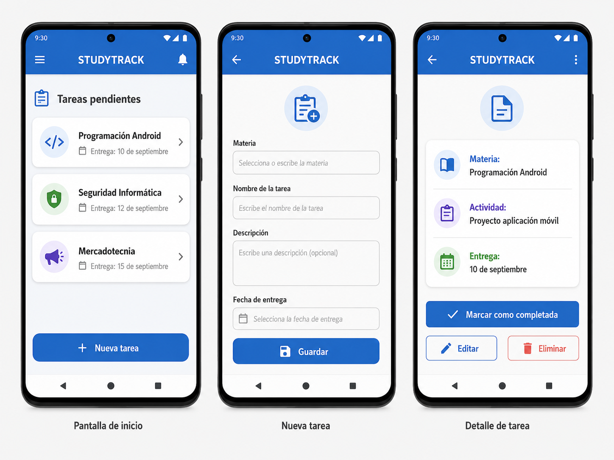

# StudyTrack

## Descripción del proyecto

StudyTrack es una aplicación móvil diseñada para ayudar a estudiantes universitarios a organizar sus tareas, trabajos, exámenes y fechas importantes desde un dispositivo Android.

La aplicación permitirá registrar actividades académicas, consultar cuáles están pendientes, establecer fechas de entrega y marcar las tareas que ya fueron completadas.

## Exposición del problema

Los estudiantes normalmente tienen diferentes materias y actividades que deben entregar durante la semana. Cuando existen varias fechas de entrega, puede ser difícil recordar todas las responsabilidades académicas.

Esto puede provocar que una persona olvide una tarea o entregue un trabajo fuera de tiempo.

StudyTrack busca solucionar este problema reuniendo las actividades académicas en una sola aplicación y mostrando de forma sencilla las tareas pendientes.

## Plataforma

La aplicación será desarrollada principalmente para dispositivos Android.

Para el desarrollo utilizaré Android Studio, ya que proporciona las herramientas necesarias para crear, probar y ejecutar aplicaciones Android.

La aplicación podrá probarse utilizando un emulador de Android o un dispositivo móvil físico.

## Interfaz de usuario

La interfaz del estudiante será sencilla y fácil de utilizar.

La pantalla principal mostrará las tareas registradas y sus fechas de entrega.

El usuario podrá:

- Registrar una nueva tarea.
- Escribir el nombre de la materia.
- Agregar una descripción.
- Seleccionar una fecha de entrega.
- Marcar una actividad como completada.
- Editar una tarea.
- Eliminar una tarea.

## Interfaz de administrador

El proyecto tendrá una interfaz administrativa básica.

El administrador podrá consultar información relacionada con los usuarios y supervisar el funcionamiento general de la aplicación.

En la primera versión del proyecto, las funciones administrativas serán limitadas, ya que el objetivo principal será desarrollar correctamente las funciones utilizadas por los estudiantes.

## Funcionalidad

Cuando el estudiante abra StudyTrack podrá observar las actividades que todavía tiene pendientes.

Al seleccionar la opción **Nueva tarea**, aparecerá un formulario donde podrá ingresar:

- Materia.
- Nombre de la tarea.
- Descripción.
- Fecha de entrega.

Después de guardar la información, la tarea aparecerá automáticamente en la pantalla principal.

Cuando el estudiante termine una actividad podrá marcarla como completada.

También podrá editarla en caso de que cambie la fecha de entrega o eliminarla cuando ya no sea necesaria.

## Diseño de la aplicación

El diseño de StudyTrack será sencillo, moderno y fácil de utilizar.

La aplicación tendrá tres pantallas principales:

### Pantalla de inicio

Mostrará las tareas pendientes y sus fechas de entrega.

También tendrá un botón para agregar una nueva tarea.

### Nueva tarea

Permitirá ingresar la materia, nombre de la tarea, descripción y fecha de entrega.

Después de completar la información, el usuario podrá presionar el botón **Guardar**.

### Detalle de tarea

Mostrará la información completa de una actividad.

El usuario podrá:

- Marcar la tarea como completada.
- Editar la tarea.
- Eliminar la tarea.

## Diseño generado para StudyTrack

## Objetivo del proyecto

El objetivo principal de StudyTrack es desarrollar una aplicación Android que ayude a los estudiantes a mejorar la organización de sus responsabilidades académicas.

Durante el desarrollo del proyecto aplicaré conocimientos relacionados con:

- Android Studio.
- Diseño de interfaces.
- Desarrollo de aplicaciones móviles.
- Almacenamiento de información.
- Organización y gestión de tareas.

## Conclusión

StudyTrack será una aplicación enfocada en solucionar un problema común entre los estudiantes: la organización de sus responsabilidades académicas.

A lo largo del término académico espero mejorar progresivamente la aplicación e incorporar nuevas funciones mientras aplico los conocimientos aprendidos durante el curso.
